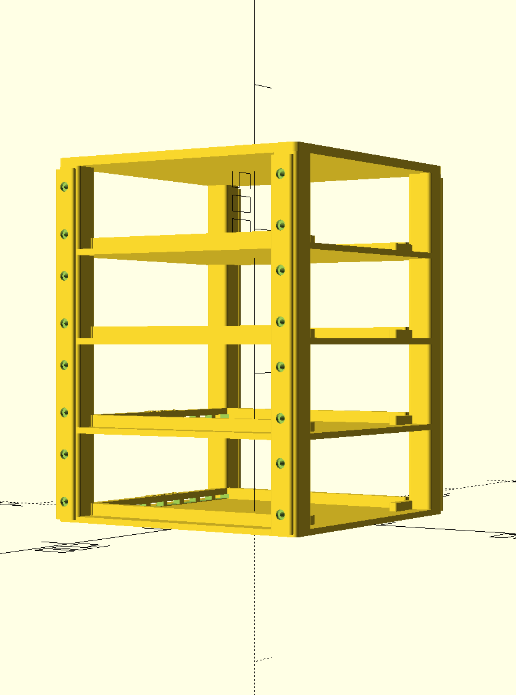
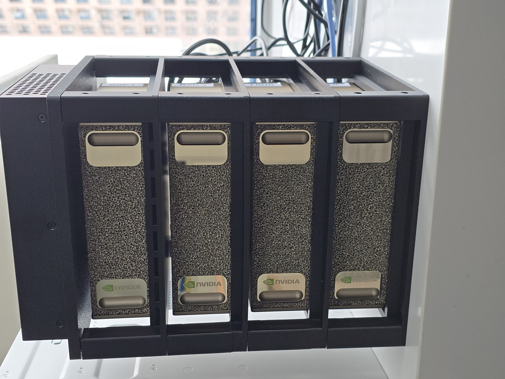

# DGX Spark Stuff

This repo will collect various DGX Spark-related work over time. 

## OpenSCAD Rack for 4x Sparks

[CAD](CAD): an OpenSCAD-based stackable 4-unit DGX Spark rack, along with exported STL parts and a reference render. The CAD folder includes the main source model, printable tray/top/joiner exports, and a DGX Spark reference body used for fit and preview.

I suggest printing this in PC (or PETG if you really can't print PC), because the surface temperatures can up to 60c under high load long term, and PLA has a glass transition temperature of ~55c so it will soften too much under load. The bottom tray can be PLA, but I suggest using PC for the rest.

<table align="center">
	<tr>
		<td align="center"></td>
		<td align="center"></td>
		<td align="center"></td>
	</tr>
	<tr>
		<td align="center">Rendered assembly</td>
		<td align="center">Real assembly</td>
		<td align="center">Thermal view</td>
	</tr>
</table>

